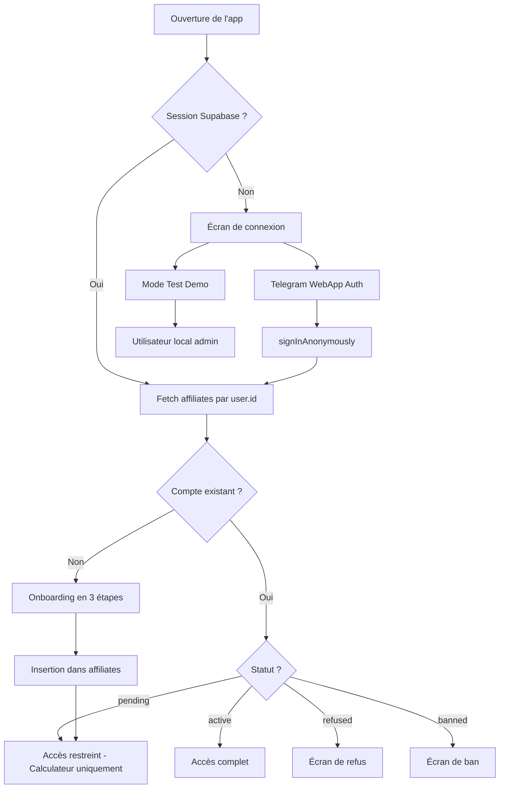
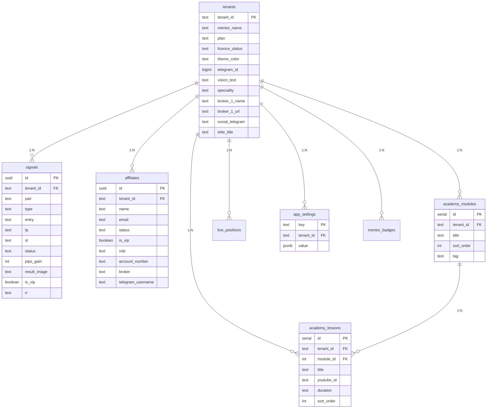

# 🖥️ MrTech 237 — Premium Terminal Mini App

## Vue d'ensemble complète du projet

> [!NOTE]
> Ce document détaille **tout ce qui a été intégré** dans le Mini App, son architecture, ses fonctionnalités et l'état actuel du développement.

---

## 1. 🏗️ Architecture Technique

### Stack Technologique

| Couche | Technologie | Version |
|---|---|---|
| **Framework** | React + TypeScript | React 19, TS 5.8 |
| **Bundler** | Vite | 6.2 |
| **Styling** | Tailwind CSS v4 | 4.1.14 |
| **Backend / BDD** | Supabase (PostgreSQL) | SDK 2.103 |
| **Storage** | Supabase Storage | Buckets publics |
| **Realtime** | Supabase Realtime (postgres_changes) | WebSocket |
| **Auth** | Supabase Auth (Anonymous + Telegram) | — |
| **Icons** | Lucide React | 0.546 |
| **Animations** | Framer Motion + CSS custom | — |
| **Serveur Dev** | Express + TSX | — |
| **Fonts** | DM Sans + Space Mono (Google Fonts) | — |

### Structure des fichiers

```
mrtech-237-premium-terminal/
├── src/
│   ├── App.tsx                  ← Composant principal (~3700 lignes)
│   ├── main.tsx                 ← Point d'entrée React
│   ├── index.css                ← Design system (Tailwind @theme)
│   ├── config.ts                ← TENANT_ID dynamique
│   ├── telegram.d.ts            ← Types Telegram WebApp
│   ├── vite-env.d.ts            ← Types Vite
│   ├── components/
│   │   └── PremiumLoader.tsx    ← Loader animé premium
│   ├── hooks/
│   │   └── useClientConfig.ts   ← Hook de config tenant (226 lignes)
│   ├── lib/
│   │   ├── supabase.ts          ← Client Supabase configuré
│   │   ├── upload.ts            ← Compression WebP + upload Storage
│   │   ├── firebase.ts          ← Legacy (plus utilisé)
│   │   └── database_schema.sql  ← Schéma complet PostgreSQL
│   └── data/
│       └── mockData.ts          ← Données de démonstration
├── server.ts                    ← Serveur Express dev
├── .env                         ← Variables Supabase
├── package.json
├── vite.config.ts
├── firestore.rules              ← Legacy Firebase
└── storage.rules                ← Legacy Firebase
```

---

## 2. 🎨 Design System

### Palette de couleurs (variables CSS / Tailwind @theme)

| Token | Valeur | Usage |
|---|---|---|
| `--color-bg-void` | `#050505` | Fond principal (quasi noir) |
| `--color-bg-surface` | `#0D0D0D` | Surfaces secondaires |
| `--color-bg-elevated` | `#141414` | Cards, modals |
| `--color-accent-neon` | `#00FF66` *(dynamique par tenant)* | Accent principal (néon vert) |
| `--color-accent-danger` | `#FF3B30` | Erreurs, SL HIT |
| `--color-accent-warning` | `#FFD60A` | Avertissements, VIP, Admin |
| `--color-text-primary` | `#F0F0F0` | Texte principal |
| `--color-text-secondary` | `#7A7A7A` | Texte secondaire |
| `--color-glass-bg` | `rgba(255,255,255,0.03)` | Fond glassmorphism |
| `--color-glass-border` | `rgba(255,255,255,0.06)` | Bordures glass |

### Composants UI réutilisables

| Composant | Description |
|---|---|
| `GlassCard` | Carte avec fond glassmorphism + blur 12px |
| `NeonButton` | Bouton principal vert néon avec `active:scale` |
| `Badge` | Badge avec 4 variantes (neon/danger/warning/secondary) |
| `NavButton` | Bouton de navigation bottom bar avec indicateur actif |
| `LoadingScreen` | Écran de chargement avec spinner animé |
| `PremiumLoader` | Loader plein écran premium avec animation |
| `MarketTicker` | Bandeau de prix simulés (XAUUSD, EURUSD, BTCUSD) |
| `LiveActivityFeed` | Flux d'activité live des 3 derniers signaux mis à jour |

### Animations CSS intégrées

- `fade-in-up` — Apparition avec translation Y
- `pulse-glow` — Pulsation néon
- `shimmer` — Effet de chargement skeleton
- `scanner-line` — Ligne de scan horizontale
- `animate-spin` / `animate-pulse` — Animations Tailwind natives

---

## 3. 🧑‍💻 Système Multi-Tenant

### Fonctionnement

```
TENANT_ID = URL ?tenant= paramètre || 'mrtech237' (défaut)
```

- Chaque tenant a sa propre entrée dans la table `tenants`
- **Toutes les données** sont filtrées par `tenant_id` dans chaque requête
- Le **thème couleur** est injecté dynamiquement via `document.documentElement.style.setProperty`
- Auto-création du tenant si un utilisateur Telegram ouvre l'app pour la première fois

### Ce qui est personnalisable par tenant

| Donnée | Source |
|---|---|
| Nom du mentor | `tenants.mentor_name` |
| Couleur du thème | `tenants.theme_color` |
| Spécialité | `tenants.speciality` |
| Années d'expérience | `tenants.years_exp` |
| Nombre de traders | `tenants.traders_count` |
| Texte de vision | `tenants.vision_text` |
| 3 brokers affiliés (nom + URL) | `tenants.broker_1/2/3_name/url` |
| 5 réseaux sociaux | `tenants.social_telegram/youtube/instagram/tiktok` |
| Offre Elite (titre, desc, prix, URL) | `tenants.elite_*` |
| Plan (basic/premium/empire) | `tenants.plan` |
| Licence (active/suspended) | `tenants.licence_status` |

---

## 4. 🔐 Authentification & Rôles

### Flow d'authentification



### Détermination du rôle Admin/Mentor

Un utilisateur est reconnu **mentor** si :
- Son `telegram_id` correspond au `telegram_id` du tenant
- Son `role` dans `affiliates` est `'admin'`
- Son `telegramUsername` correspond au `TENANT_ID` (case-insensitive)
- Son email est `michelnyembo506@gmail.com` (super-admin hardcodé)

### Système de permissions

| Rôle | Signaux | Academy | Calculateur | Profil | Admin |
|---|---|---|---|---|---|
| **Visiteur** (pending) | ❌ | ❌ | ✅ | ❌ | ❌ |
| **User** (active) | Gratuits seulement | 2 leçons gratuites | ✅ | ✅ (lecture) | ❌ |
| **VIP** (is_vip=true) | ✅ Tous | ✅ Toutes | ✅ | ✅ (lecture) | ❌ |
| **Mentor/Admin** | ✅ Tous + édition | ✅ Toutes + édition | ✅ | ✅ (lecture/écriture) | ✅ |

---

## 5. 📱 Les 5 Onglets du Mini App

### 📊 Onglet 1 — Dashboard / Signaux Live

**Composant:** `DashboardTab`

**Fonctionnalités intégrées :**
- ✅ **Header sticky** avec indicateur LIVE pulsant et statut marché (ouvert/fermé selon UTC)
- ✅ **Market Ticker** — Prix simulés en temps réel (XAUUSD, EURUSD, BTCUSD) actualisés toutes les 3s
- ✅ **Flux d'activité live** — 3 dernières mises à jour de signaux avec statut coloré
- ✅ **Carrousel "Dernières Victoires"** — Images des résultats TP_HIT récents
- ✅ **Bannière VIP** — CTA pour passer au plan VIP (si non-VIP)
- ✅ **Liste des signaux** avec pour chaque signal :
  - Paire (XAUUSD, etc.) + Type (BUY/SELL)
  - Badge VIP / GRATUIT
  - Statut coloré : LIVE 🟢 / TP_HIT ✅ / SL_HIT ❌ / ANNULÉ ⚠️ / CLOSED ⚪
  - Grille de données : Entrée, Stop Loss, Target 1, Target 2
  - Ratio R:R
  - Timestamp relatif ("Il y a 5m")
  - Images de résultats (multi-images supportées, séparées par `||`)
  - Visualisation plein écran des captures au clic
- ✅ **Système de verrouillage VIP** — Les signaux VIP sont floutés (blur 12px) avec overlay + CTA "Débloquer l'accès"
- ✅ **Bannière broker affilié** en bas (Exness, XM, JustMarkets)
- ✅ **Upload d'images de résultat** (admin uniquement) — Compression WebP + upload Supabase Storage
- ✅ **Restrictions plan Basic** — Indicateur "BASIC: 3/DAY" si plan basic

### Modals associés :
- **VipModal** — Tarifs VIP (1 mois 200€, 2 mois 249€, 1 an 697€, à vie 1495€)
- **BrokerModal** — Instructions pour débloquer l'Academy via inscription broker

---

### 🎓 Onglet 2 — Academy

**Composant:** `AcademyTab`

**Fonctionnalités intégrées :**
- ✅ **Barre de progression** — Pourcentage de leçons complétées avec barre verte animée
- ✅ **Compteur** — "X / Y" leçons terminées
- ✅ **Bouton "Ajouter une leçon"** (admin uniquement) → redirige vers Admin > Academy
- ✅ **Bannière "Mode Visiteur"** (si non-VIP) avec CTA "Débloquer"
- ✅ **Modules accordéon** — Chaque module se déplie au clic :
  - Tag du module (badge)
  - Titre + nombre de leçons
  - Background image avec overlay semi-transparent
- ✅ **Grille de leçons** (2 colonnes) :
  - Thumbnail YouTube auto-fetchée (`img.youtube.com/vi/{id}/mqdefault.jpg`)
  - Titre + durée
  - Bouton "Fait" / "Ok" pour marquer comme complétée (persisté en localStorage)
  - Clic → Player YouTube en plein écran (embed avec autoplay)
- ✅ **Verrouillage par niveau** :
  - Users non-VIP : 2 premières leçons gratuites, les autres sont verrouillées (blur + badge PREMIUM)
  - Restriction plan premium : max 5 leçons
- ✅ **Player vidéo modal** — iFrame YouTube plein écran avec bouton "Marquer comme terminé"
- ✅ **Données réelles depuis Supabase** avec realtime (tables `academy_modules` + `academy_lessons`)

---

### 🧮 Onglet 3 — Calculateur de Lot (Terminal)

**Composant:** `TerminalTab`

**Fonctionnalités intégrées :**
- ✅ **Input solde du compte** avec formatage automatique (virgules pour milliers)
- ✅ **Slider de risque** (0.1% à 100%) avec :
  - Indicateur visuel CONSERVATEUR ↔ AGRESSIF
  - Affichage du montant risqué en $
  - Maximum recommandé : 2%
- ✅ **Sélecteur de mode d'entrée** : Pips ou Prix
  - Mode **Pips** : Input Stop Loss + Take Profit en pips
  - Mode **Prix** : 3 champs (Entrée, SL Price, TP Price) avec calcul automatique des pips
- ✅ **Sélecteur d'instrument** : FOREX / XAUUSD / US30
- ✅ **Résultat animé** — Carte principale avec :
  - **Volume suggéré (LOT)** en grand format avec saisie manuelle possible
  - **Pip Value** calculée dynamiquement
  - **Risque Net** en rouge avec icône TrendingDown
  - **Potentiel Gain** en vert avec icône TrendingUp
  - **Ratio R:R** avec indicateur visuel (vert si ≥2, orange si <2)
- ✅ **Bannière broker** en bas
- ✅ **Disclaimer** légal en bas
- ✅ **Accessible même en mode "pending"** (accès restreint)

---

### 👤 Onglet 4 — Profil du Mentor

**Composant:** `ProfileTab`

**Fonctionnalités intégrées :**
- ✅ **Photo de profil** circulaire avec :
  - Bordure néon + glow
  - Badge vérifié (ShieldCheck)
  - Upload au clic (admin) avec loader de synchronisation
- ✅ **Nom éditable** (admin) — Titre + sous-titre cliquables
- ✅ **Badges dynamiques** — Années d'exp, Spécialité, Nombre de traders (depuis `tenants` ou `mentor_badges`)
- ✅ **Liens réseaux sociaux** — 5 boutons : Telegram, WhatsApp, YouTube, TikTok, Instagram
- ✅ **Section "Ma Vision"** :
  - Texte éditable (admin) avec textarea en mode édition
  - Image de vision (uploadable)
- ✅ **Galerie de résultats** — Grille 2x2 de 4 images, toutes uploadables par l'admin
- ✅ **Timeline / Parcours** :
  - Ligne verticale avec points néon
  - Chaque entrée : année + milestone (éditables)
  - Bouton "Ajouter" (admin)
  - Bouton "Supprimer" (admin, au hover)
- ✅ **Section Coaching Elite** :
  - Image d'affiche (uploadable)
  - Titre + description dynamiques depuis tenant
  - CTA → lien contact (Telegram/WhatsApp)
- ✅ **Section "Démarrer ton trading"** — 2 boutons broker + 1 broker alternatif
- ✅ **Section Contact** — 5 boutons réseaux sociaux colorés
- ✅ **Carte utilisateur** — Username, statut, badge admin, date d'inscription
- ✅ **Bouton Admin** (si admin) → Terminal Admin
- ✅ **Bouton déconnexion** (2 emplacements)
- ✅ **Toggle VIP** (auto-modification) — L'admin peut activer/désactiver son propre VIP

---

### ⚙️ Onglet 5 — Admin (Mentor uniquement)

**Composant:** `AdminTab` — 4 sous-onglets

#### 5A. Admin > Signaux
- ✅ **Formulaire "Nouveau Signal"** :
  - Paire (input texte libre)
  - Type (BUY/SELL select)
  - Toggle VIP
  - Entrée, Stop Loss, TP1, TP2
  - Bouton "Diffuser le Signal"
- ✅ **Liste des signaux récents** avec actions :
  - ✅ TP HIT (avec prompt pips gagnés)
  - ❌ SL HIT
  - ⚠️ ANNULER
  - 📷 Ajouter une image de résultat
  - 🗑️ Supprimer le signal
  - 🗑️ Supprimer une image individuelle

#### 5B. Admin > Affiliés
- ✅ **Liste des affiliés** avec pour chacun :
  - Nom + username Telegram
  - Statut (pending/active/refused/banned)
  - Badge VIP PRO
  - ID compte broker + nom du broker
- ✅ **Actions** :
  - APPROUVER (si pending)
  - REFUSER
  - PASSER VIP / RETIRER VIP
  - SUPPRIMER
- ✅ **Realtime** — Subscription postgres_changes sur la table affiliates

#### 5C. Admin > Academy
- ✅ **Gestion des modules** :
  - Liste avec bouton de suppression
  - Bouton "+ Ajouter Module" (prompt titre)
- ✅ **Formulaire "Nouvelle Vidéo Formation"** :
  - Titre
  - Lien/ID YouTube (extraction automatique de l'ID)
  - Durée
  - Module de destination (select)
- ✅ **Liste des leçons publiées** :
  - Thumbnail YouTube
  - Titre + module + durée
  - Bouton éditer (pré-remplit le formulaire)
  - Bouton supprimer

#### 5D. Admin > Profil
- ✅ **Formulaire complet d'édition du tenant** :
  - **Identité** : Nom du mentor, Spécialité, Années d'exp, Nombre de traders, Vision
  - **Brokers** : 3 brokers avec nom + URL
  - **Réseaux sociaux** : Telegram, YouTube, Instagram, TikTok
  - **Accompagnement Elite** : Titre, Description, Tarif, Lien contact
- ✅ **Sauvegarde** → Upsert dans la table `tenants` + événement `tenant-profile-updated`
- ✅ **Loader premium** pendant la sauvegarde

---

## 6. 🗄️ Base de Données (Supabase PostgreSQL)

### Schéma — 8 tables



### Row Level Security (RLS)
- ✅ RLS activé sur les 8 tables
- ⚠️ Actuellement : policies `USING (true)` — toutes les opérations sont autorisées
- 🔜 À faire : policies basées sur `auth.uid()` et `tenant_id`

### Storage Buckets
| Bucket | Public | Usage |
|---|---|---|
| `profile` | ✅ | Photos de profil, vision, résultats, coaching |
| `results` | ✅ | Captures d'écran de résultats de signaux |

---

## 7. ⚡ Système Realtime

### Subscriptions actives (postgres_changes)

| Canal | Table | Filtre | Déclencheur |
|---|---|---|---|
| `global_signals` | `signals` | `tenant_id=eq.{TENANT_ID}` | Refetch signaux |
| `global_modules` | `academy_modules` | `tenant_id=eq.{TENANT_ID}` | Refetch modules |
| `global_lessons` | `academy_lessons` | `tenant_id=eq.{TENANT_ID}` | Refetch leçons |
| `profile` | `app_settings` | `key=eq.profile_{TENANT_ID}` | Refetch images profil |
| `content` | `app_settings` | `key=eq.content_{TENANT_ID}` | Refetch contenu profil |
| `victories-updates` | `signals` | `tenant_id=eq.{TENANT_ID}` | Refetch victoires |
| `user_{id}` | `affiliates` | `id=eq.{user.id}` | Refetch données user |
| `aff` | `affiliates` | `tenant_id=eq.{TENANT_ID}` | Refetch liste affiliés (admin) |

→ **8 canaux realtime** pour une synchronisation instantanée sans refresh.

---

## 8. 📤 Système d'Upload d'Images

### Pipeline

```
Sélection fichier → Compression client-side → Conversion WebP (qualité 0.8)
    → Redimensionnement max 1200px → Upload Supabase Storage
    → Génération URL publique → Update en BDD
```

- **Compression côté client** via Canvas API (pas de dépendance serveur)
- **Format WebP** pour optimiser la taille
- **Timeout de 120s** avec messages d'erreur explicites
- **Safety reset** de 65s pour les états de chargement bloqués
- **Support multi-images** par signal (séparées par `||`)

---

## 9. 🔗 Intégration Telegram WebApp

### Fonctionnalités Telegram intégrées

- ✅ `tg.ready()` — Signal de prêt à Telegram
- ✅ `tg.expand()` — Expansion plein écran
- ✅ `tg.setHeaderColor('#050505')` — Thème sombre du header Telegram (v6.1+)
- ✅ `tg.setBackgroundColor('#050505')` — Fond assorti
- ✅ `tg.initDataUnsafe.user` — Récupération automatique du profil Telegram
- ✅ `tg.openLink()` — Ouverture de liens externes via Telegram
- ✅ Détection automatique du mentor via `telegram_id`

---

## 10. 📊 État Actuel & Récapitulatif

### ✅ Ce qui est FAIT et FONCTIONNEL

| Module | Statut | Détails |
|---|---|---|
| Design System Glassmorphism | ✅ Complet | Dark mode, néon, animations |
| Multi-tenant par URL param | ✅ Complet | `?tenant=xxx` |
| Thème couleur dynamique | ✅ Complet | Injection CSS runtime |
| Auth Telegram + Anonymous | ✅ Complet | signInAnonymously |
| Onboarding 3 étapes | ✅ Complet | Welcome → Form → Confirmation |
| Signaux Live (CRUD) | ✅ Complet | Création, statut, images, suppression |
| Signaux VIP verrouillés | ✅ Complet | Blur + overlay + CTA |
| Academy (modules + leçons) | ✅ Complet | YouTube embed, progression locale |
| Calculateur de Lot | ✅ Complet | 2 modes (pips/prix), 3 instruments |
| Profil Mentor éditable | ✅ Complet | Textes, images, timeline |
| Admin Panel complet | ✅ Complet | 4 sous-onglets |
| Upload images WebP | ✅ Complet | Compression + Storage Supabase |
| Realtime Supabase | ✅ Complet | 8 canaux postgres_changes |
| Gestion affiliés | ✅ Complet | Approve/Refuse/Ban/VIP/Delete |
| Brokers affiliés | ✅ Complet | 3 brokers configurables |
| Réseaux sociaux | ✅ Complet | 5 plateformes |
| Coaching Elite | ✅ Complet | Section avec affiche + CTA |
| Licence suspended | ✅ Complet | Écran de blocage |
| Mode Test Demo | ✅ Complet | Bouton accès admin local |
| Loader Premium | ✅ Complet | Animation de chargement |
| Toast notifications | ✅ Complet | Success/Error avec auto-dismiss |

### ⚠️ Points d'attention

| Point | Détail |
|---|---|
| RLS ouvert | Les policies Supabase sont `USING (true)` → à restreindre pour la production |
| Prix simulés | Le MarketTicker affiche des prix random, pas de vraie API de marché |
| Fichier monolithique | `App.tsx` fait ~3700 lignes → refactoring recommandé |
| Firebase legacy | Les fichiers `firebase.ts`, `firestore.rules`, `storage.rules` ne sont plus utilisés |
| Pas de PWA | Pas de service worker ni manifest pour installation |

### 📈 Statistiques du code

| Métrique | Valeur |
|---|---|
| Lignes totales `App.tsx` | **3,681** |
| Taille `App.tsx` | **180 KB** |
| Composants React | **~15** |
| Tables Supabase | **8** |
| Canaux Realtime | **8** |
| Modals | **4** (VIP, Coaching, Broker, Video Player) |
| Onglets navigation | **5** (Live, Academy, Calcul, Profil, Admin) |
| Sous-onglets Admin | **4** (Signals, Affiliés, Academy, Profil) |
